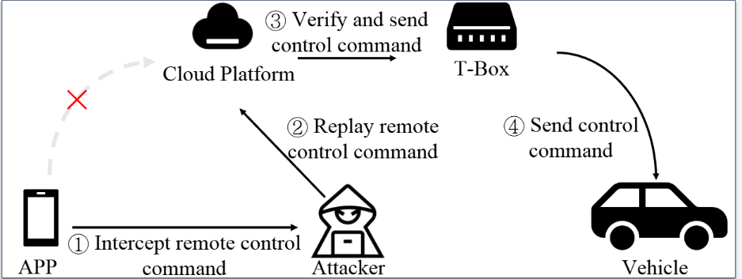
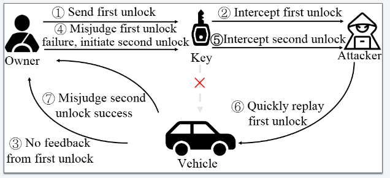

## Study of attack surfaces

Based on the classification of ICV vulnerabilities by location and type, this section studies the main attack surfaces of ICV vulnerabilities.
We divide exploits reported by competitors into remote attacks, mid-range attacks, and short-range attacks according to the approximate distance required between the attacker and the vehicle. 

### Remote attack surface

   

Fig 1: A typical remote ICV attack surface.

Fig. 1 illustrates a typical remote ICV vulnerability exploit reported by competitors. Vehicle owners typically send remote control commands via an APP, such as pre-activating the air conditioning. However, an attacker may intercept the APP’s operation, obtain vehicle control commands (①), and replay them at an opportune moment (②). The cloud platform verifies the received command and sends a control instruction to the T-Box (③), which then transmits the command to the corresponding ECU for execution (④). Without proper verification and encrypted transmission, remote attacks can occur through multiple pathways. For instance, an attacker may access the cloud platform via a web browser to remotely control the vehicle or steal private data. Given the critical role of the cloud platform, manufacturers should enhance security measures and refine authorization mechanisms to effectively prevent remote attacks.

### Mid-range attack surface

   

Fig 2: A typical mid-range ICV attack surface.

Unauthorized unlocking by relaying/replaying the radio key fob unlock signal is a typical mid-range attack surface. Fig. 2 illustrates a common mid-range ICV attack surface reported by competitors. Normally, the owner can send a signal to unlock the vehicle (①). Howerver, an attacker equipped with specialized equipment like high-gain antennas and Software-Defined Radios[1] can intercept the vehicle's unlock signal from several meters away[2, 3], causing the vehicle to provide no feedback (③). Then the owner might mistakenly judge that the first unlock signal was not sent successfully and then send a second unlock signal (④). At this point, the attacker can once again intercept the second unlock signal (⑤) and quickly replay the first unlock signal (⑥), resulting in the vehicle unlocking successfully. Meanwhile, the owner might mistakenly assume that the second unlock was successful (⑦), unaware that the attacker has stored the second unlock signal for future potential unauthorized unlocks. It can be seen that, under mid-range attack scenarios, adding a validity period check to the unlock signal can effectively prevent such replay attacks.

### Short-range attack surface

Attacks on IVI, T-Box, and network modules are typically classified as short-range attacks. Similar to tablets and smartphones, the attack surface of IVI and T-Box are very similar to traditional mobile OS. The main attack surfaces involve scanning entry points, such as open network ports and debug interface, for penetration testing to gain access to the IVI and T-Box systems. Therefore, for short-range attacks, protecting open ports and interfaces, as well as timely updating of software, are effective preventative measures.

## Study of attack surfaces with types and locations

The additional column named "Attack surface" has been added to the existing dataset. Based on this "Attack surface" column, the following two dimensions have been compared:

- Vulnerability location and attack surface
- Vulnerability type and attack surface

### Vulnerability location and attack surface

Table 1: Mapping location results of the attack surface taxonomy

| Location-subtype | Short-range | Mid-range | Remote | Sum  |
| :--------------: | :---------: | :-------: | :----: | :--: |
|  Cloud platform  |             |           |  245   | 245  |
|       IVI        |     197     |           |   11   | 208  |
|       APP        |             |     2     |   64   |  66  |
|       ECU        |     46      |           |        |  46  |
|     Network      |     30      |     1     |        |  31  |
|      T-Box       |     22      |           |   6    |  28  |
|      Radio       |      3      |    12     |        |  15  |
|  Charging pile   |             |           |   10   |  10  |
|       Sum        |     298     |    15     |  336   | 649  |

According to the data presented in Table. 1, the attack surfaces are categorized into short-range, mid-range, and remote attacks, with totals of 298, 15, and 336 respectively:

- The 298 short-range attacks are predominantly found in in-vehicle components, including IVI (In-Vehicle Infotainment) with 197 instances, ECU (Electronic Control Unit) with 46 instances, and T-Box with 22 instances.
- The 15 mid-range attacks are primarily directed towards the radio, with 12 instances reported.
- The 336 remote attacks are largely concentrated in the cloud platform, accounting for 245 instances, and the APP (Application), with 64 instances.

Here are three insights gleaned from Table 2:

1. **In-Vehicle Components are High-Risk for Short-Range Attacks:** The majority of short-range vulnerabilities are associated with in-vehicle systems like IVI, ECU, and T-Box. This suggests a need for enhanced security measures within vehicle electronics to mitigate the risk of local attacks.
2. **Radio Systems are Vulnerable to Mid-Range Threats:** With all mid-range attacks targeting the radio, it indicates that radio systems may have specific vulnerabilities that need to be addressed to prevent potential mid-range security breaches.
3. **Cloud and APP Platforms are Prime Targets for Remote Attacks:** The high number of remote attacks on cloud platforms and applications indicates that these areas are critical targets for cyber threats. Strengthening security protocols for cloud services and mobile applications should be a priority to protect against remote exploitation.

### Vulnerability type and attack surface

Table 2: Mapping type results of the attack surface taxonomy

| Vulnerability type  | Short-range | Mid-range | Remote | Sum  |
| :-----------------: | :---------: | :-------: | :----: | :--: |
|    Authorization    |     109     |           |  127   | 236  |
| Information leakage |     22      |           |   90   | 112  |
|      Injection      |     20      |           |   59   |  79  |
|         OS          |     53      |           |   2    |  55  |
|         DoS         |     38      |     1     |   8    |  47  |
|   File operation    |     15      |           |   23   |  38  |
|    Interception     |     21      |    14     |   1    |  36  |
|    Web-specific     |             |           |   26   |  26  |
|       Memory        |     20      |           |        |  20  |
|         Sum         |     298     |    15     |  336   | 649  |

According to the data in Table. 2, regarding vulnerability types:

- Authentication vulnerabilities, such as unauthorized accessing and identity spoofing, along with
  information leakage and injection vulnerabilities like SQL injection and command injection, are
  predominantly concentrated on the remote attack surface.
- OS-related vulnerabilities, including kernel issues and arbitrary software installation, as well as DoS
  attacks, are primarily focused on the short-range attack surface.
- File operation vulnerabilities, which encompass file accessing, downloading, tampering, uploading,
  traversal, and deletion, are more evenly distributed between the short and remote attack surfaces.
- Interception vulnerabilities, such as relay, replay, and man-in-the-middle attacks, are balanced between
  the short and mid-range attack surfaces, with mid-range vulnerabilities being exclusive to the interception type.

From the data presented, we can derive the following insights:

1. **Boost Remote Security:** The high number of authentication and injection flaws in remote attacks calls for stronger security protocols. Researchers should focus on better authentication and input validation to defend against these threats.
2. **Fortify OS and Kernel:** The concentration of OS vulnerabilities in short-range attacks shows a need to improve operating system and kernel security. Efforts should aim at developing more secure kernel architectures and software installation processes.
3. **Safeguard File Operations:** With file operation vulnerabilities spread across attack surfaces, securing file handling is crucial. This includes tight access controls, integrity checks, and secure download or deletion to prevent unauthorized access and breaches.

[1] Software-defined Radios: Architecture, state-of-the-art, and challenges. Computer Communications 2018

[2] RollBack: A New Time-Agnostic Replay Attack Against the Automotive Remote Keyless Entry Systems. ACM Trans. Cyber-Phys. Syst. 2024

[3] Breaking BLE Beacons For Fun But Mostly Profit. EuroSec 2017